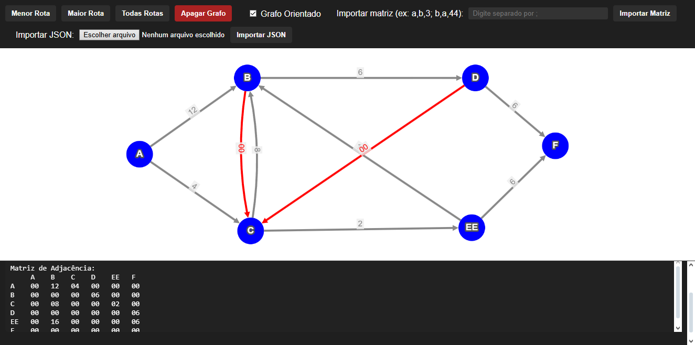

# 🚀 Editor de Grafos Interativo

 

> Um editor de grafos online, visual, dinâmico e fácil de usar. Crie, edite, visualize e explore grafos orientados ou não orientados. Gere matrizes de adjacência e descubra rotas, menores caminhos, maiores caminhos e todas as possibilidades entre dois nós.

---

## ✨ Funcionalidades

- 🎨 **Criação de Nós** – Clique no canvas e adicione nós com ID e nome.
- 🔗 **Criação de Arestas** – Clique em dois nós e defina o peso da conexão.
- 🔄 **Grafo Orientado ou Não Orientado** – Altere com um clique, sem perder os dados.
- 🏹 **Exploração de Rotas**
  - Menor caminho 🔽
  - Maior caminho 🔼
  - Todas as rotas possíveis 🔍
- 📥 **Importação de Matriz** – Insira uma matriz no formato `a,b,3; b,c,5; ...` e o grafo é gerado automaticamente.
- 📑 **Geração da Matriz de Adjacência** – Visualização clara e formatada.
- 🗑️ **Apagar o Grafo** – Limpeza total com um clique.
- 🎯 **Edição e Remoção de Arestas** – Clique na aresta para editar peso ou remover.
- 📂 **Importação de JSON** – Importe grafos completos via arquivos `.json`.

---

## 🔧 Tecnologias Utilizadas

- ⚙️ **[Cytoscape.js](https://js.cytoscape.org/)** – Motor de renderização de grafos.
- 🎨 **HTML + CSS** – Interface limpa, com tema escuro e canvas branco.
- 💻 **JavaScript Vanilla** – Lógica completa sem frameworks pesados.

---

## 💡 Como Usar

1. Clone o repositório:

```bash
git clone https://github.com/Victor-SRamos/GRAFO.git
```

2. Abra o arquivo `index.html` no seu navegador.

3. ✅ Pronto! Você já pode começar a desenhar seus grafos.

---

## 🔢 Formato da Importação de Matriz

```plaintext
origem,destino,peso; origem2,destino2,peso2; ...
```

### Exemplo:

```plaintext
a,b,5; b,c,2; c,a,7
```

---

## 🗂️ Formato da Importação de JSON

O arquivo JSON deve conter dois arrays: `nodes` e `edges`.

### Estrutura:

```json
{
  "nodes": [
    { "id": "a", "label": "A", "color": "blue", "x": 100, "y": 150 },
    { "id": "b", "label": "B", "color": "blue", "x": 200, "y": 250 }
  ],
  "edges": [
    { "source": "a", "target": "b", "weight": 5 }
  ]
}
```

- **nodes**: cada nó deve ter `id` e `label`. As propriedades `color`, `x` e `y` são opcionais.
- **edges**: cada aresta deve ter `source`, `target` e `weight`. O `id` da aresta pode ser omitido.

---

## 🧠 Como Funciona

- O sistema permite construir grafos **clicando diretamente no canvas**.
- Selecione um nó, depois outro, e uma aresta será criada entre eles (com peso personalizado).
- A qualquer momento, ative ou desative a opção de **grafo orientado**.
- Clique em uma aresta para **editar seu peso ou removê-la**.
- Insira matrizes manualmente no campo específico e veja o grafo se formar automaticamente.
- Importe grafos completos no formato JSON, contendo nós e arestas.

---

## 🎯 Screenshots

| Construção de Grafo | Caminhos gerados Gerada |
|---------------------|---------------|
|  |  |

---

## 🛠️ Melhorias Futuras

- 🧠 Algoritmos de Dijkstra e Bellman-Ford.
- 📤 Exportação de matrizes e grafos para arquivos.
- 🎨 Escolha de cores para nós e arestas.
- 🔄 Layouts automáticos para organização visual.

---

## 🤝 Contribuição

Contribuições são bem-vindas! Abra uma *issue*, envie um *pull request* ou sugira melhorias.

---

## 📄 Licença

Este projeto está sob a licença MIT. Veja o arquivo [LICENSE](./LICENSE) para mais detalhes.

---

## 🚀 Autor

Desenvolvido por [Victor](https://github.com/Victor-SRamos). 👩‍💻📚
